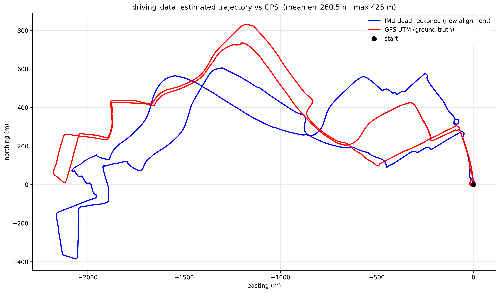
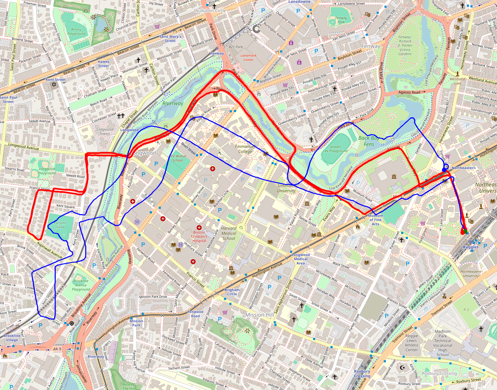
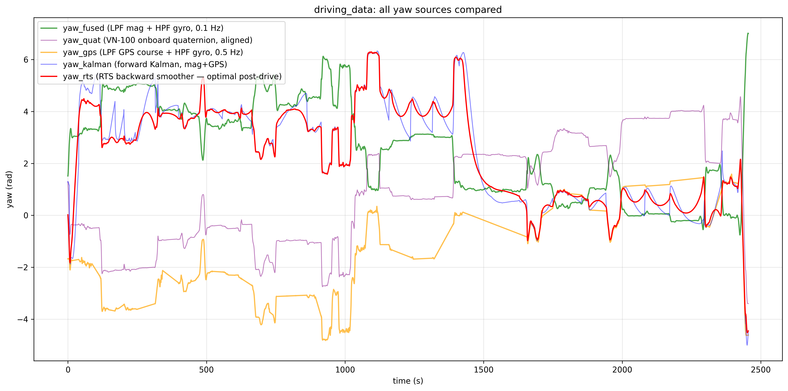
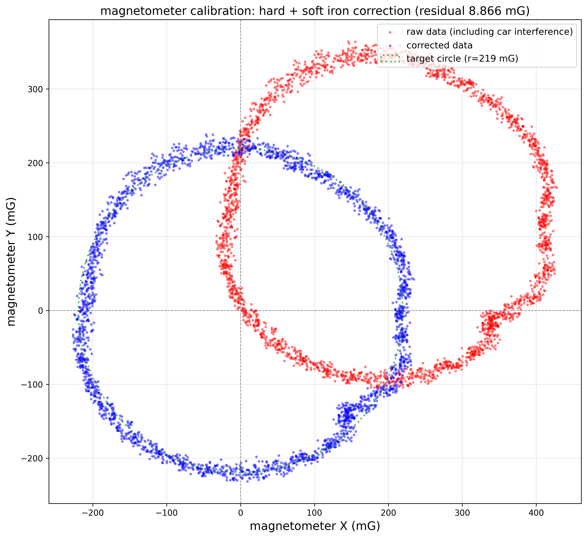
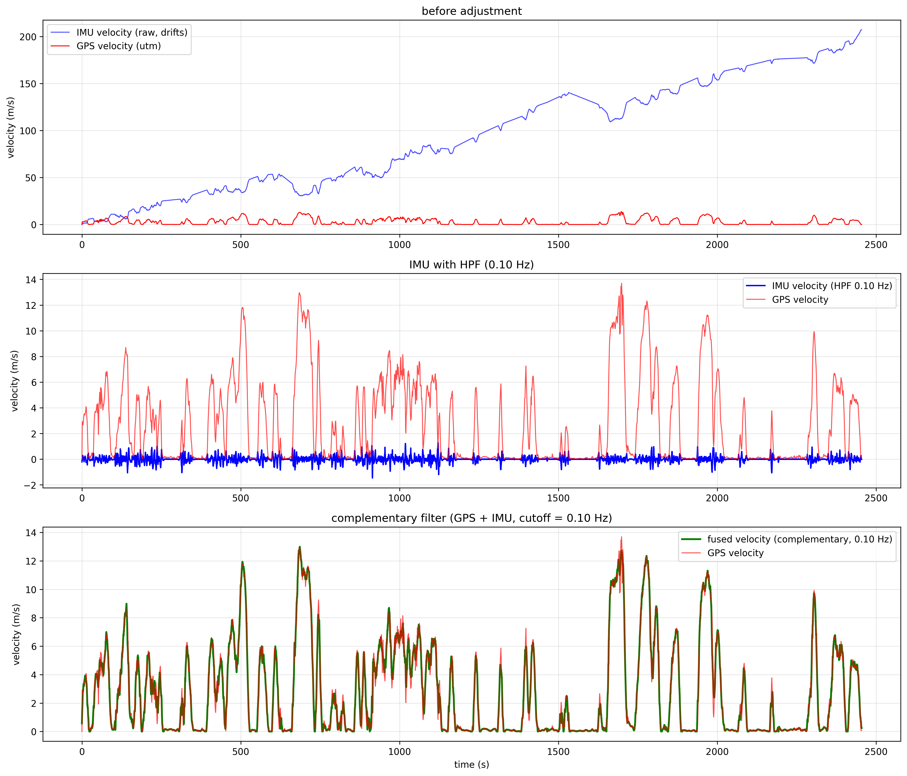
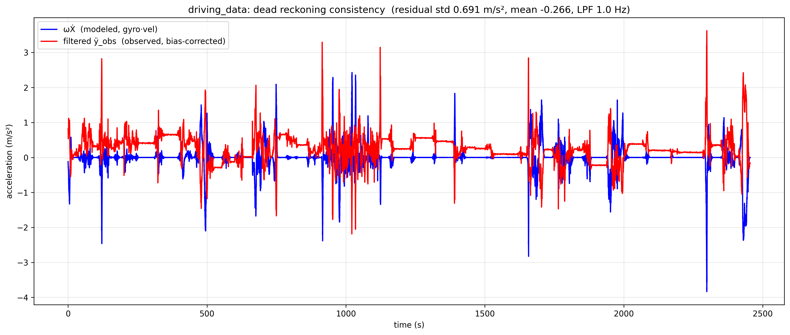
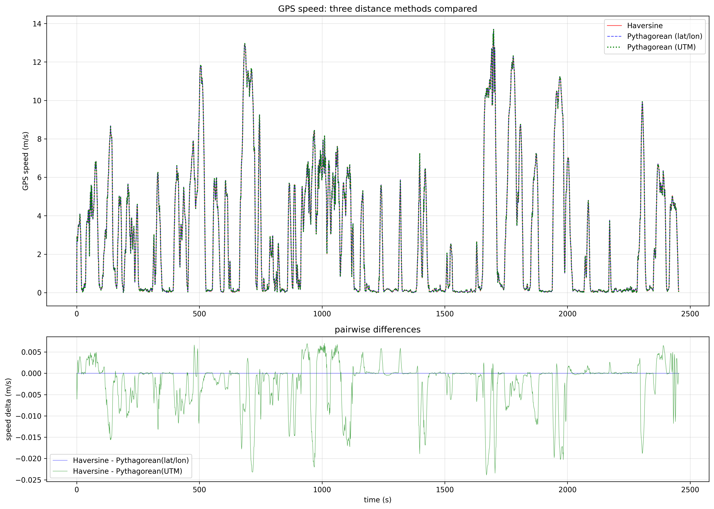

# Automotive Dead Reckoning

[](https://github.com/Kiran1510/Automotive-Dead-Reckoning/actions/workflows/ci.yml)

2-D position estimation for a vehicle using a VectorNav VN-100 IMU (40 Hz) and a BU-353N GPS (1 Hz). Originally a Northeastern University EECE 5554 lab; the pipeline has since been rewritten end-to-end with a calibrated bag→CSV converter, principled bias estimation from stationary recordings, a Kalman filter that uses GPS course as a yaw observation, and CI that exercises the whole chain on every push.

A 41-minute Boston drive ends with the dead-reckoned trajectory within **260 m mean / 425 m max** of GPS ground truth (Kalman heading, the default). Older pipelines that relied on magnetometer alone for heading were 3× looser.



🗺️ **[See it on a real map: interactive Google My Maps view of this drive](https://www.google.com/maps/d/u/0/viewer?mid=1FudtXW8NFN7n-mvAs4K1Nh8OhTILkUw)**

---

## Quickstart

If you already have the four `.mcap` bags in `data/` and Python 3.10+, **five commands gets you the final plot**:

```bash
python3 -m venv .venv
.venv/bin/pip install -r requirements.txt
for d in data/*/; do .venv/bin/python scripts/bag_to_csv.py "$d"; done
.venv/bin/python scripts/calibration.py
.venv/bin/python scripts/yaw.py driving_data && \
  .venv/bin/python scripts/velocity.py driving_data && \
  .venv/bin/python scripts/trajectory.py driving_data
```

Then open `build/driving_data/trajectory_imu_vs_gps.png`. Done.

---

## Prerequisites

- **Python 3.10 or newer** (tested on 3.12 and 3.14)
- ~100 MB of disk space for the venv, ~70 MB for the raw bags (largest is `driving_data` at 64 MB), ~30 MB for the generated CSVs and plots
- **A working `python3 -m venv`** (some Linux distros ship without it — install `python3-venv` if `venv` fails)
- **No ROS install required** — the bag converter uses [`rosbags`](https://pypi.org/project/rosbags/), which reads `.mcap` directly and registers the custom message types embedded in the bag itself

You will need the four data bags (see *Getting the data* below). They are not in the repo.

---

## Setup (one-time)

```bash
# 1. Clone the repo
git clone https://github.com/Kiran1510/Automotive-Dead-Reckoning.git
cd Automotive-Dead-Reckoning

# 2. Create a virtual environment (using the in-repo .venv keeps it isolated)
python3 -m venv .venv

# 3. Install dependencies (numpy, pandas, scipy, matplotlib, rosbags)
.venv/bin/pip install -r requirements.txt

# 4. Verify the install works
.venv/bin/python -c "import rosbags, numpy, pandas, scipy, matplotlib; print('OK')"
```

The `.venv/` directory is gitignored — it lives only on your machine.

---

## Getting the data

The four ROS2 `.mcap` bags are **not in the repo** (they're large and binary; `data/` is gitignored). Place them under `data/`, one subdirectory per recording, each containing the `.mcap` plus the standard ROS2 `metadata.yaml`:

```
data/
├── circle_data/
│   ├── circle_data_0.mcap
│   └── metadata.yaml
├── driving_data/
│   ├── driving_data_0.mcap
│   └── metadata.yaml
├── engine_on/
│   ├── engine_on_0.mcap
│   └── metadata.yaml
└── idle_car/
    ├── idle_car_0.mcap
    └── metadata.yaml
```

Each recording captures different conditions; the pipeline needs all four:

| Bag | Duration | Vehicle state | Used for |
|---|---|---|---|
| `circle_data` | ~65 s | Driving in tight circles, engine on | Hard/soft-iron magnetometer calibration via ellipse fit |
| `idle_car` | ~17 s | Parked, engine off | Gyro & accelerometer bias (noise floor) |
| `engine_on` | ~37 s | Parked, engine running | Same as idle_car, but with engine vibration. Used to characterize engine-induced magnetic offset and to inform Kalman noise tuning |
| `driving_data` | ~41 min | Full Boston driving run | The main analysis target. Produces the final trajectory plot |

If your file names differ, you can either rename to match the table above or point the scripts at custom directories — every script accepts `--build <dir>` and explicit paths.

If you only want to see the pipeline run without obtaining the full bags, **CI does this on every push** against a 5-second fixture bag committed at `tests/fixtures/driving_tiny/` — see the workflow log at the badge link above.

---

## The pipeline at a glance

```
data/<dataset>/*.mcap                              raw ROS2 bag (drop new datasets here)
        │
        ▼   scripts/bag_to_csv.py
build/<dataset>/{imu.csv, gps.csv}                 flat CSVs (quaternion preserved)
        │
        ▼   scripts/calibration.py
config/calibration.json                            hard/soft iron, biases, mount tilt, noise floors
        │
        ▼   scripts/yaw.py <dataset>
build/<dataset>/yaw.csv  +  four yaw plots
        │
        ▼   scripts/velocity.py <dataset>
build/<dataset>/velocity.csv  +  3-panel plot  +  GPS-distance comparison
        │
        ▼   scripts/dead_reckon.py <dataset>
build/<dataset>/dead_reckoning_comparison.png      ωẊ vs lateral-acc consistency check
        │
        ▼   scripts/trajectory.py <dataset>
build/<dataset>/trajectory_imu_vs_gps.png          final 2D dead-reckoned path vs GPS
```

Each stage emits artifacts to `build/<dataset>/` and prints a `new-vs-old` numeric comparison so any refactor is held to a "match or exceed" standard. The `build/` directory is gitignored except for PNG outputs (which are checked in so they're browsable on GitHub).

---

## Running the pipeline

### Full run (driving_data, default settings)

```bash
# 1. Convert every bag in data/ to CSV (idempotent; safe to re-run)
for d in data/*/; do .venv/bin/python scripts/bag_to_csv.py "$d"; done

# 2. Produce calibration constants from circle_data + idle_car + engine_on
.venv/bin/python scripts/calibration.py

# 3. Heading estimation (writes build/driving_data/yaw.csv + 5 plots)
.venv/bin/python scripts/yaw.py driving_data

# 4. Forward velocity (writes velocity.csv + 3-panel plot + comparative GPS study)
.venv/bin/python scripts/velocity.py driving_data

# 5. Rigid-body consistency check (writes dead_reckoning_comparison.png)
.venv/bin/python scripts/dead_reckon.py driving_data

# 6. Final 2-D trajectory vs GPS truth (writes trajectory.csv + trajectory plot)
.venv/bin/python scripts/trajectory.py driving_data
```

To re-run for a different dataset (say `engine_on`), repeat steps 3–6 with that name. The calibration is dataset-agnostic — you only need to run step 2 once.

### Useful optional flags

| Stage | Flag | Effect |
|---|---|---|
| `velocity.py` | `--gps-method utm` (default) | Pythagorean on UTM easting/northing |
| `velocity.py` | `--gps-method haversine` | Great-circle distance from lat/lon |
| `velocity.py` | `--gps-method pythagorean` | Equirectangular flat-Earth on lat/lon |
| `trajectory.py` | `--yaw-source kalman` (default) | Kalman with mag + GPS observations |
| `trajectory.py` | `--yaw-source fused` | Legacy LPF(mag) + HPF(gyro) |
| `trajectory.py` | `--yaw-source quat` | VN-100 onboard quaternion |
| `trajectory.py` | `--yaw-source gps` | Complementary GPS-course + gyro |
| `trajectory.py` | `--yaw-source rts` | Kalman + RTS smoother (experimental) |

All three GPS methods are computed *every run* regardless of `--gps-method`; the flag only picks which one feeds the complementary velocity filter. The comparison CSV (`gps_distance_methods.csv`) is always written.

### Verifying a tuning change

After modifying any Kalman noise parameters or filter logic, run the verification tool:

```bash
.venv/bin/python scripts/verify_filter.py idle_car
.venv/bin/python scripts/verify_filter.py engine_on
```

On stationary bags, true yaw is constant, so each filter's output std measures its residual uncertainty. Smaller is better. Use this to confirm a change didn't regress, *before* checking the much-slower trajectory accuracy on `driving_data`.

---

## Scripts reference

Every script supports `--help`. Quick summary:

| Script | One-line purpose | Reads | Writes |
|---|---|---|---|
| `scripts/bag_to_csv.py <bag_dir>` | Convert a single `.mcap` bag to flat CSVs | `data/<bag>/*.mcap` | `build/<bag>/{imu,gps}.csv` |
| `scripts/inspect_bag.py <bag_dir>` | Dump the schema of `/imu` and `/gps` messages (debug aid for unfamiliar bags) | `data/<bag>/*.mcap` | stdout |
| `scripts/slice_bag.py <src> <duration_s> <dst>` | Trim a bag down to its leading N seconds (used to make the CI fixture) | source bag | new bag |
| `scripts/calibration.py` | Magnetometer hard/soft iron + gyro/accel bias + tilt analysis + noise floors | `build/{circle_data, idle_car, engine_on, driving_data}/imu.csv` | `config/calibration.json` + `build/circle_data/magnetometer_calibration.png` |
| `scripts/yaw.py <dataset>` | All five heading streams (mag, gyro, complementary, quat, Kalman, RTS) | `build/<dataset>/{imu,gps}.csv` + `config/calibration.json` | `build/<dataset>/yaw.csv` + 5 PNGs |
| `scripts/velocity.py <dataset>` | Fused forward velocity from GPS + IMU | `build/<dataset>/{imu,gps}.csv` + calibration JSON | `velocity.csv` + 2 PNGs + GPS-method comparison CSV |
| `scripts/dead_reckon.py <dataset>` | ω·V vs ÿ_obs rigid-body sanity check | `build/<dataset>/{imu,velocity}.csv` + calibration JSON | `dead_reckoning_comparison.png` |
| `scripts/trajectory.py <dataset>` | 2-D path integration in UTM frame with alignment to GPS | `build/<dataset>/{yaw,velocity,gps}.csv` | `trajectory.csv` + `trajectory_imu_vs_gps.png` |
| `scripts/verify_filter.py <dataset>` | Diagnostic: compares all yaw streams' std on a dataset; flags inconsistencies | `build/<dataset>/yaw.csv` | stdout |
| `scripts/map_trajectory.py <dataset>` | Overlay GPS + IMU dead-reckoned trajectories on real-world map tiles | `build/<dataset>/{gps,trajectory}.csv` | `trajectory_on_map.{html,kml,png}` |

---

## Output interpretation

### `build/driving_data/trajectory_imu_vs_gps.png`


The headline plot. Blue is the dead-reckoned path computed only from the IMU's integrated velocity and chosen yaw source; red is the GPS UTM ground truth. They should track each other closely; divergence reveals heading drift.

With the default `--yaw-source kalman`, expect **260 m mean / 425 m max / 325 m final** error over the 41-minute drive.

### `build/driving_data/trajectory_on_map.png`



Same two trajectories overlaid on real-world map tiles via `scripts/map_trajectory.py`.
Red is the GPS ground truth (Mission Hill / Fenway / Northeastern area for this drive),
blue is the IMU dead-reckoning. The drift becomes interpretable in geographic context —
e.g. when blue cuts through buildings while red follows a street.

**🗺️ [Explore this drive interactively on Google My Maps](https://www.google.com/maps/d/u/0/viewer?mid=1FudtXW8NFN7n-mvAs4K1Nh8OhTILkUw)** — pan, zoom, switch between street / satellite / terrain layers.

The script also writes:
- `trajectory_on_map.html` — interactive Folium map (open in any browser, pan/zoom/click)
- `trajectory_on_map.kml` — load into Google Earth, Google My Maps, or phone GPS apps (this is the file imported into the Google My Maps link above)

### `build/driving_data/yaw_all_sources.png`



Overlay of all five yaw streams. The Kalman/RTS streams (red and blue) should track each other tightly; `yaw_fused` (green) visibly drifts upward over the drive because the magnetometer is responding to magnetic interference, not real rotation. `yaw_quat` (purple) is the VN-100's own answer.

### `build/circle_data/magnetometer_calibration.png`



Red scatter is the raw magnetometer field while driving in circles (offset, elliptical). Blue scatter is the same data after applying the computed hard- and soft-iron correction; it should overlap the green target circle. A small residual `radius std` (printed by `calibration.py`) means a good fit.

### `build/driving_data/velocity_three_panel.png`



Top: raw IMU-integrated speed (drifts because acc_x bias residuals integrate over the run) vs GPS speed. Middle: same IMU speed after a high-pass filter at 0.10 Hz — drift removed, short-term structure preserved. Bottom: the complementary fused speed (green) — GPS at low frequency + IMU at high frequency — closely tracks GPS while keeping IMU's sample-rate responsiveness.

### `build/driving_data/dead_reckoning_comparison.png`



ω·V (predicted lateral accel from yaw rate × forward speed) plotted against the measured lateral accel. Curves should overlap in shape; a constant offset reveals a residual acc_y bias that the filters didn't fully remove.

### `build/driving_data/gps_distance_methods.png`



Three GPS-derived speed traces overlaid (Haversine, Pythagorean lat/lon, Pythagorean UTM). The lower panel shows pairwise deltas — typically below 0.025 m/s, three orders of magnitude under GPS noise. The takeaway is "the choice between these three doesn't matter for accuracy at car-segment scale; pick the one that matches your coordinate frame."

### `build/driving_data/yaw_complementary_filter.png` and `yaw_four_panel.png`

Two complementary views of the legacy `yaw_fused` filter. The two-panel version shows LPF(mag) and HPF(gyro) separately and then their sum (the fused yaw). The four-panel adds the VN-100 onboard quaternion yaw as an independent reference. Both make the magnetometer-drift problem visible: the LPF mag yaw is fairly stable in the middle of the drive but drifts at the ends, where the Kalman filter would be relying on GPS instead.

---

## Yaw source comparison (the most interesting result)

The complementary filter (`yaw_fused`) drifts ~50° RMS over 41 minutes of Boston driving because urban magnetic field varies spatially. Anchoring yaw to GPS course instead makes a measurable difference in trajectory accuracy:

| `--yaw-source` | mean (m) | max (m) | final (m) | Notes |
|---|---|---|---|---|
| **`kalman`** (default) | **260** | **425** | 325 | Forward Kalman with magnetometer + GPS course |
| `fused` | 763 | 2454 | 263 | Legacy complementary filter (LPF mag + HPF gyro) |
| `quat` | 508 | 1316 | 1294 | VN-100 onboard sensor fusion |
| `gps` | 2279 | 4387 | **58** | GPS course / gyro complementary — best endpoint, wanders mid-drive |
| `rts` | 1710 | 3136 | 209 | Kalman + RTS smoother (experimental) |

The RTS smoother is provably optimal under linear-Gaussian assumptions and *does* outperform the forward Kalman on stationary data (verified with `verify_filter.py idle_car`: yaw_rts std 0.010° vs yaw_kalman 0.10°). On the long urban drive the model assumptions break down — that's an open research direction tracked in the project's local design notes.

---

## Continuous integration

`.github/workflows/ci.yml` runs the full pipeline on every push and pull request against a committed 5-second fixture bag (`tests/fixtures/driving_tiny/`). It:

1. Sets up Python 3.12 and installs `requirements.txt`
2. Converts the fixture bag
3. Runs yaw, velocity (both UTM and Haversine variants), dead_reckon, trajectory
4. Asserts every expected output exists with non-zero size
5. Validates the canonical column schemas on `imu.csv` and `gps.csv`

Total runtime ~30 s. The fixture calibration JSON at `tests/fixtures/calibration.json` is pinned so the analysis stages have something deterministic to read against.

---

## Repository structure

```
├── data/                              # raw .mcap bags (gitignored; you put bags here)
│   ├── circle_data/
│   ├── driving_data/
│   ├── engine_on/
│   └── idle_car/
├── build/                             # generated outputs (gitignored except PNGs)
│   ├── circle_data/                   # magnetometer_calibration.png + CSVs
│   └── driving_data/                  # yaw / velocity / dead_reckon / trajectory plots + CSVs
├── config/
│   └── calibration.json               # produced by scripts/calibration.py — committed
├── scripts/
│   ├── bag_to_csv.py                  # .mcap → imu.csv + gps.csv
│   ├── inspect_bag.py                 # dump bag schema
│   ├── slice_bag.py                   # cut leading N seconds of a bag
│   ├── calibration.py                 # produce config/calibration.json
│   ├── yaw.py                         # five heading streams
│   ├── velocity.py                    # GPS + IMU fused velocity
│   ├── dead_reckon.py                 # ωẊ vs ÿ_obs consistency check
│   ├── trajectory.py                  # final 2-D path + alignment to GPS
│   └── verify_filter.py               # stationary-data filter regression check
├── tests/fixtures/                    # CI fixture bag + pinned calibration snapshot
├── .github/workflows/ci.yml           # CI definition
├── circle_data/, driving_data/        # original lab submission preserved for reference
├── requirements.txt
├── Lab5 Report.pdf
└── README.md
```

The legacy `circle_data/` and `driving_data/` top-level directories contain the original lab CSVs/scripts; they're kept for reference but are not part of the new pipeline. Everything new is under `scripts/` and `data/` / `build/`.

---

## Troubleshooting

### `python3 -m venv` complains it can't find `venv` module

On Debian/Ubuntu run `sudo apt-get install python3-venv` (or `python3.12-venv` for a specific version). On macOS with Homebrew Python this works out of the box.

### `ModuleNotFoundError: No module named 'rosbags'`

Activate the venv first, or call its Python explicitly:
```bash
.venv/bin/python scripts/bag_to_csv.py data/driving_data
```
(All examples in this README use the absolute `.venv/bin/python` path so this can't happen.)

### `FileNotFoundError: data/driving_data/metadata.yaml`

The script is looking for the standard ROS2 bag layout. Check that each dataset directory contains both the `.mcap` file *and* `metadata.yaml`. If you only have the `.mcap`, you can synthesize the metadata with `ros2 bag info <file>.mcap > metadata.yaml` (requires a ROS install), or grab it from someone who recorded the bag.

### Pipeline emits a sensible value at every stage but the final trajectory plot is wildly off

Check that you ran `scripts/calibration.py` first — it writes `config/calibration.json` which `yaw.py`, `velocity.py`, and `trajectory.py` all depend on. The committed `config/calibration.json` corresponds to the original recordings; if you swap in new bags, recalibrate.

### `bag_to_csv.py` fails with a typestore error

Make sure your `rosbags` version is recent (≥ 0.10): `.venv/bin/pip install -U rosbags`. The converter uses `AnyReader`, which auto-registers the custom message types embedded in the bag — older versions didn't support that.

---

## Methods (summary)

- **Magnetometer calibration**: Fitzgibbon-Pilu-Fisher direct ellipse fit on the `circle_data` recording, giving 2-D hard-iron offset + soft-iron matrix. Quality metric (radius-std after correction) is 5.5% tighter than the old midpoint-of-min/max approach.
- **Gyro / accelerometer bias**: mean of stationary `idle_car` readings (replaces "first 10 s of driving" — which we verified was *not* actually stationary on this dataset).
- **Mount-tilt analysis**: cross-checks the gravity vector across all three stationary windows (idle_car, engine_on, first-10s-of-driving). Pitch is stable across recordings → fixed 3-D printed mount; roll spreads with parking-spot camber.
- **Heading fusion**: defaults to a Kalman filter with state `[yaw, gyro_bias]`, magnetometer measurement at every IMU sample, GPS course as an additional observation when speed > 3 m/s.
- **Velocity fusion**: complementary filter, LPF GPS at 0.10 Hz + HPF IMU at 0.10 Hz. UTM-based GPS distance by default for consistency with the trajectory frame; Haversine and Pythagorean lat/lon available as alternatives via flag.
- **Trajectory alignment**: initial heading from a weighted centroid over the first 30 s of moving GPS samples (more robust than the original 2-point estimate at low speed).

A more detailed write-up is in `Lab5 Report.pdf`.

---

## Author

**Kiran Sairam Bethi Balagangadaran**
MS Robotics, Northeastern University

## License

MIT. See `LICENSE`.

## Acknowledgments

- Dr Kris Dorsey
- Northeastern University EECE 5554 Course Staff
- ROS2 community
- Open-source sensor driver contributors
- Only parts of the main branch of this repository was generated using LLM-assisted coding applications (Claude Code, Opus 4.6 with 1M token window). There may be mismatches between features described in the README and the actual code. If you come across any, please raise an issue.
